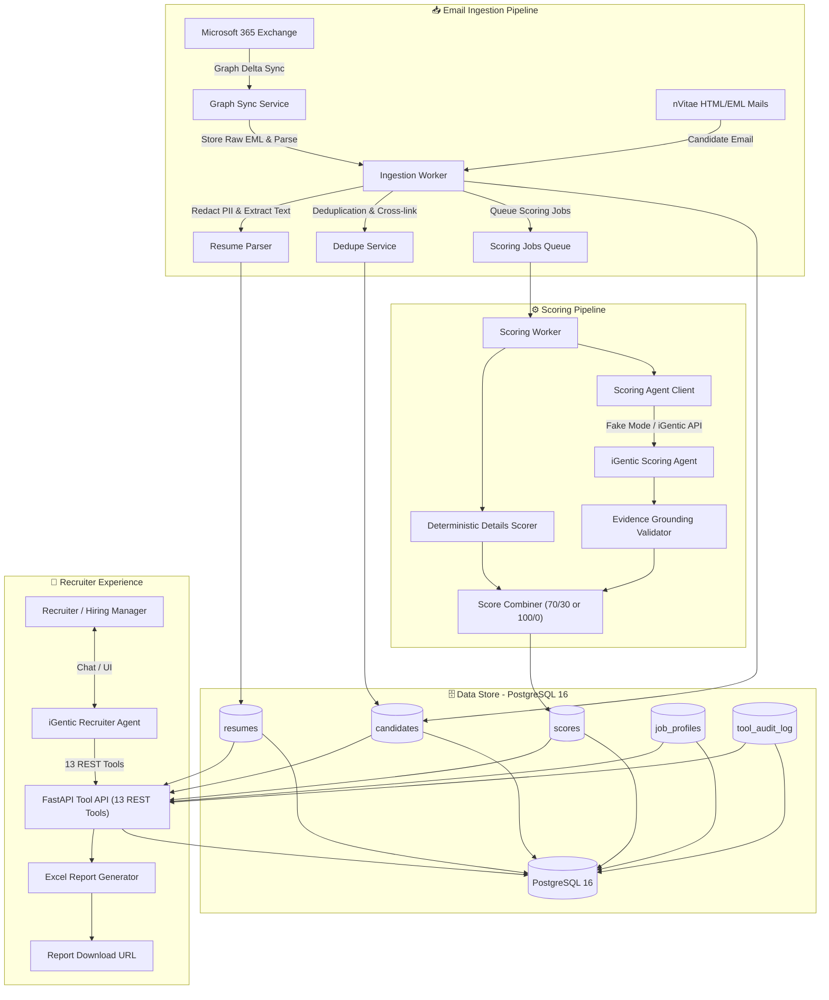
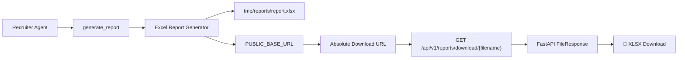

# 🎯 Email-Based Candidate Screening Backend

> An intelligent, production-ready candidate profile screening backend powered by **iGentic platform agents**.

---

## 💡 Overview

The screening engine uses two specialized **iGentic platform agents**:

* 🤖 **Recruiter Agent (`Recruiter_Agent`)**: Conversational assistant armed with **13 REST tools** to manage job profiles, execute intelligent candidate searches, inspect detailed score breakdowns, and issue dynamic reports.
* ⚡ **Scoring Agent (`Scoring_Agent`)**: A stateless, tool-free evaluator that ingests anonymized candidate resumes & JDs to output deterministic evaluation JSON adhering strictly to scoring rubrics.

---

## 🏗️ 1. System Architecture & Workflows

The backend architecture handles **4 core flows**:

1. **Email Ingestion**: Captures incoming M365 and nVitae emails.
2. **Candidate Processing**: Performs automatic PII redaction, resume parsing, multi-tier deduplication, and queues scoring jobs.
3. **Dual Scoring Pipeline**: Blends deterministic parameter scoring with AI resume evaluation.
4. **Recruiter Interface**: Empowers recruiters via 13 API tools for search, ranking, and Excel report generation.

---

### 🔄 Architectural Dataflow



### 🚀 End-to-End Candidate Screening Flow

```mermaid
flowchart LR

    A["📧 Candidate Email"] --> B["Microsoft Graph / nVitae"]
    B --> C["Ingestion Worker"]
    C --> D["PII Redaction"]
    D --> E["Resume Text Extraction"]
    E --> F["Candidate Deduplication"]
    F --> G["Candidate + Resume Stored"]

    G --> H["Active Job Profile"]
    H --> I["Scoring Job Queue"]
    I --> J["Scoring Worker"]

    J --> K["Candidate Details Score (30%)"]
    J --> L["iGentic Scoring Agent - Resume Score (70%)"]

    L --> M["Evidence Grounding Validation"]
    K --> N["Score Combiner"]
    M --> N

    N --> O["Final Candidate Score"]
    O --> P["Ranking Run"]

    P --> Q["Recruiter Agent"]
    Q --> R["Search / Dossier / Ranking"]
    R --> S["Excel Report"]
    S --> T["Absolute Download URL"]
```



### 📊 Report Generation & Download Flow



---

## 📂 Repository Structure

```text
Email-based candidate profile screening agent/
│
├── 📂 backend/
│   ├── 📂 app/
│   │   ├── main.py             # FastAPI Application Entrypoint
│   │   ├── config.py           # App Settings & Environment Vars
│   │   ├── 📂 models/          # Database Models (SQLAlchemy)
│   │   ├── 📂 schemas/         # Pydantic Schemas
│   │   ├── 📂 services/        # Core Business Logic Services
│   │   ├── 📂 workers/         # Pipeline Background Workers
│   │   └── 📂 routers/         # API Endpoint Controllers
│   │
│   ├── 📂 alembic/             # Database Migration Scripts
│   ├── 📂 tests/               # Pytest Unit & Integration Tests
│   ├── 📂 scripts/             # Execution Scenarios & Utility Scripts
│   ├── requirements.txt        # Backend Python Dependencies
│   └── .env.example            # Environment Template
│
├── 📂 agent-prompts/
│   ├── Recruiter_Agent.md     # Recruiter Agent System Instructions
│   ├── Scoring_Agent.md       # Scoring Agent System Instructions
│   ├── TOOLS_CONFIG.md        # Function/Tool Manifest Schemas
│   └── TOOLS_REFERENCE.md     # Expanded Tool Usage Guides
│
├── docker-compose.yml          # Container Infrastructure Setup
└── README.md                   # Project Documentation
```

---

## ⭐ 2. Key Features

* **🧮 Dual-Scoring Formula**: Standard: 70% Resume Score + 30% Candidate Details. Fallback: Renormalizes to 100% Candidate Details when resume is missing/unreadable (flagged with `resume_missing`).
* **🔍 Evidence Grounding Verification**: Automatically detects and penalizes hallucinatory evaluation outputs by checking claims directly against raw resume text.
* **👥 Multi-Tier Deduplication**: Detects duplicates via email, phone, fuzzy name + company matching, and resume hashes, creating flags (`duplicate_flags`) for review.
* **🛡️ Prompt Injection Defense**: Anonymizes evaluation inputs and enforces deterministic score calculations in Python to reject prompt override attempts.
* **⚡ Budget Guard & Circuit Breaker**: Features a rolling daily budget cap ($50/day limit) and error rate limits to protect against unexpected API spend.
* **📝 Audit-Logged Tool API**: Captures caller ID, execution parameters, execution time, and system responses in `tool_audit_log`.

---

## ⚡ 3. Quickstart

### Prerequisites

* Docker & Docker Compose *(Recommended)* or Python 3.11+ with PostgreSQL 16.

### Option A: Running via Docker Compose *(Recommended)*

1. Clone repository and navigate to root:
   ```bash
   cd "P:\Projects\Igentic\Email-based candidate profile screening agent"
   ```
2. Spin up database and backend services:
   ```bash
   docker compose up -d --build
   ```
3. Verify API endpoints:
   ```bash
   # Liveness probe
   curl http://localhost:8000/health
   # Result: {"status":"ok","service":"talentpool-backend"}

   # Readiness probe
   curl http://localhost:8000/ready
   # Result: {"status":"ready","database":"connected"}
   ```
4. Explore Swagger API Documentation: Open `http://localhost:8000/docs` in your browser.

### Option B: Local Development Setup

1. Create and activate a virtual environment:
   ```bash
   python -m venv venv
   source venv/bin/activate  # On Windows: venv\Scripts\activate
   ```
2. Install project dependencies:
   ```bash
   pip install -r backend/requirements.txt
   ```
3. Configure environment settings:
   ```bash
   cp backend/.env.example backend/.env
   # Ensure DATABASE_URL is updated with local PostgreSQL settings
   ```
4. Apply database migrations:
   ```bash
   cd backend
   alembic upgrade head
   ```
5. Start server:
   ```bash
   uvicorn app.main:app --host 0.0.0.0 --port 8000 --reload
   ```

---

## ⚙️ 4. Configuration Reference (`backend/.env`)

| Variable | Default | Description |
| :--- | :--- | :--- |
| `DATABASE_URL` | `postgresql+asyncpg://...` | Asynchronous SQLAlchemy connection string |
| `APP_ENV` | `development` | Deployment environment (`development`, `production`, `test`) |
| `PUBLIC_BASE_URL` | `http://localhost:8000` | Public host address for report URLs |
| `SCORING_AGENT_MODE` | `fake` | Execution mode: `fake` (mock testing) or `igentic` (live API) |
| `IGENTIC_BASE_URL` | `https://api.igentic.ai` | Target iGentic API Endpoint |
| `IGENTIC_API_KEY` | `""` | Auth Key for iGentic API Services |
| `IGENTIC_SCORING_APP_ID` | `""` | App ID assigned to Scoring Agent |
| `IGENTIC_RECRUITER_APP_ID` | `""` | App ID assigned to Recruiter Agent |
| `IGENTIC_USERNAME` | `recruiter-system` | System identity string for audit trails |
| `MS_TENANT_ID` | `""` | Azure AD / Entra Tenant ID (Optional) |
| `MS_CLIENT_ID` | `""` | Azure App Client ID (Optional) |
| `MS_CLIENT_SECRET` | `""` | Azure App Secret (Optional) |
| `MAILBOX_UPN` | `""` | Target Microsoft 365 Mailbox UPN (Optional) |
| `DAILY_BUDGET_CENTS` | `5000` | Pipeline execution cap per day in cents ($50.00) |
| `RATE_LIMIT_PER_MINUTE` | `60` | Tool API request rate limit |

> ℹ️ **Note:** If Microsoft Graph credentials are left empty, mailbox sync gracefully operates in non-blocking stub mode.

---

## 🤖 5. The Two iGentic Agents

### 1. Recruiter Agent (`Recruiter_Agent`)
* **Role:** Interactive Recruiter Assistant.
* **Prompt Spec:** `agent-prompts/Recruiter_Agent.md`
* **Tools:** Uses 13 system tools defined in `agent-prompts/TOOLS_CONFIG.md` and `agent-prompts/TOOLS_REFERENCE.md`.
* **Behavior:** Fully database-grounded. Validates IDs, demands required parameters, and enforces active job profiles before generating candidates rankings.

### 2. Scoring Agent (`Scoring_Agent`)
* **Role:** Independent Candidate Evaluator.
* **Prompt Spec:** `agent-prompts/Scoring_Agent.md`
* **Tools:** None (Tool-free). Operates strictly as a structured transformation function.
* **Behavior:** Receives candidate resume text and evaluation rubrics, producing standard scoring JSON. Resistant to candidate resume prompt injections.

---

## 🛠️ 6. Recruiter Agent Tools Catalog (13 Tools)

| ID | Tool Name | Endpoint | Function |
| :---: | :--- | :--- | :--- |
| **1** | `get_pool_stats` | `POST /api/v1/tools/get_pool_stats` | Fetches overall pipeline metrics, candidate totals, and status breakdowns. |
| **2** | `sync_mailbox` | `POST /api/v1/tools/sync_mailbox` | Triggers delta synchronization with M365 Graph API. |
| **3** | `list_job_profiles` | `POST /api/v1/tools/list_job_profiles` | Lists job profiles filtered by status (`draft`, `active`, `inactive`). |
| **4** | `save_job_profile` | `POST /api/v1/tools/save_job_profile` | Creates or updates job profiles with custom rubrics. |
| **5** | `activate_job_profile` | `POST /api/v1/tools/activate_job_profile` | Sets JD status to active and enqueues candidate batch scoring jobs. |
| **6** | `deactivate_job_profile` | `POST /api/v1/tools/deactivate_job_profile` | Inactivates JD, cancels pending scoring jobs, and retains history. |
| **7** | `get_scoring_status` | `POST /api/v1/tools/get_scoring_status` | Queries real-time queue progress and evaluation failure rates. |
| **8** | `search_candidates` | `POST /api/v1/tools/search_candidates` | Filters pool by skills, years of experience, notice period, and location. |
| **9** | `get_candidate` | `POST /api/v1/tools/get_candidate` | Returns candidate profile details, scores, and evaluation timeline. |
| **10** | `rank_candidates` | `POST /api/v1/tools/rank_candidates` | Generates a fixed candidate ranking run based on specified criteria. |
| **11** | `find_duplicates` | `POST /api/v1/tools/find_duplicates` | Queries system flags to identify duplicate candidate records. |
| **12** | `merge_candidates` | `POST /api/v1/tools/merge_candidates` | Merges duplicate candidate entries into a single target record. |
| **13** | `generate_report` | `POST /api/v1/tools/generate_report` | Generates formatted Excel reports (`.xlsx`) with absolute download links. |

---

## 🌐 7. Complete System Overview

```text
                                CANDIDATE EMAIL
                                       |
                                       v
                         +---------------------------+
                         | Microsoft Graph / nVitae |
                         +---------------------------+
                                       |
                                       v
                             +------------------+
                             | Ingestion Worker |
                             +------------------+
                                |      |      |
                                |      |      +--> Deduplication
                                |      |
                                |      +---------> PII Redaction
                                |
                                +---------------> Resume Extraction
                                       |
                                       v
                              Candidate + Resume
                                       |
                                       v
                                PostgreSQL 16
                                       |
                                       v
                                Scoring Queue
                                       |
                                       v
                              +----------------+
                              | Scoring Worker |
                              +----------------+
                                 |          |
                                 |          +----------------------+
                                 |                                 |
                                 v                                 v
                          Details Scorer                 iGentic Scoring Agent
                             (30%)                               (70%)
                                 |                                 |
                                 |                                 v
                                 |                         Evidence Grounding
                                 |                                 |
                                 +---------------+-----------------+
                                                 |
                                                 v
                                            Final Score
                                                 |
                                                 v
                                            Ranking Run
                                                 |
                                                 v
                                     iGentic Recruiter Agent
                                                 |
                                +----------------+----------------+
                                |                |                |
                                v                v                v
                          Search/Dossier      Ranking      Generate Report
                                                                 |
                                                                 v
                                                             XLSX File
                                                                 |
                                                                 v
                                                       Absolute Download URL
                                                                 |
                                                                 v
                                                      Recruiter / External Agent
```

---

## 🧪 8. Testing & Verification

### Running Unit & Integration Tests

Run `pytest` to verify service functions and API routers:
```bash
cd backend
python -m pytest -q
# Expected Output: 27 passed in < 6s
```

### Running End-to-End Workflow Validation

Simulate the full candidate ingestion, scoring, and recruiter conversation flow:
```bash
python scripts/run_recruiter_scenario.py
```

#### Scenario script execution sequence:

1. Ingresses raw emails (`nvite_sample_1.html`, `nvite_sample_2.html`, `nvite_sample_1.eml`).
2. Obtains candidate pool metrics via `get_pool_stats`.
3. Creates a new JD draft using `save_job_profile`.
4. Lists registered profiles using `list_job_profiles`.
5. Confirms security check: Rejects unactivated ranking (`rank_candidates` ➔ `400 JD_REQUIRED`).
6. Triggers `activate_job_profile` to start background queue processing.
7. Processes batch evaluations in deterministic `fake` mode.
8. Monitors queue completion with `get_scoring_status` (reaps 100% status).
9. Creates a candidate ranking snapshot using `rank_candidates`.
10. Inspects individual dossiers using `get_candidate`.
11. Generates downloadable formatted spreadsheet reports via `generate_report`.
12. Deactivates JD via `deactivate_job_profile` and verifies non-destructive queue cancellation.
13. Restores active state using `activate_job_profile`.

### Interactive Agent Integration Testing

Verify agent responses using live iGentic platform credentials:
```bash
python scripts/test_recruiter_agent_chat.py
