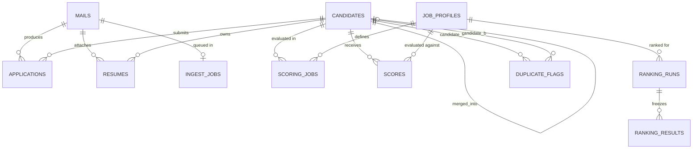

# Hybrid Talent Pool v2 — PostgreSQL Database Schema Specification

**Document Path:** `docs/SCHEMA.md`  
**Target Engine:** PostgreSQL 16+  
**Design Authority:** Reconciled from Low-Level Design (`03_LLD_Low_Level_Design.docx`), High-Level Design (`02_HLD_High_Level_Design.docx`), and architectural overrides.

---

## 1. Architectural Overrides & Design Principles

1. **All-in-Postgres Data Store:**
   - Replaces Azure Blob Storage: Raw mail bodies and headers reside in `mails.raw_body_text`, `mails.raw_body_html`, and `mails.raw_headers` (`jsonb`). Resumes reside in `resumes.file_content_bytes` (`bytea`) with an enforced 10MB limit.
   - Replaces Azure Service Bus: Asynchronous queueing is implemented via PostgreSQL-backed queue tables (`ingest_jobs`, `scoring_jobs`) with transactional job claims (`FOR UPDATE SKIP LOCKED`), retry counters, backoff timestamps, and failure state transitions.
2. **Multi-Tenant Simplification:**
   - Every core table maintains a nullable `tenant_id UUID NULL` column for seamless forward compatibility.
   - PostgreSQL Row Level Security (RLS) policies and dedicated role-based switching (`SET LOCAL app.tenant_id`) are deferred in this initial phase per Section 2 Override 4.
3. **No Active JD = No Scores:**
   - Candidates are ingested and stored without requiring an active Job Description (`status = stored_unscored`).
   - Scores can only be created for job profiles that have transitioned to `status = 'active'`. Foreign keys and application logic enforce this invariant.

---

## 2. Entity-Relationship Overview

---

## 3. Comprehensive Table Specifications

### 3.1 `mails`
Records every raw email retrieved from Microsoft Graph mailbox synchronization or manual ingest.

| Column | Type | Nullable | Default | Description |
|---|---|---|---|---|
| `id` | `UUID` | No | `gen_random_uuid()` | Primary Key |
| `tenant_id` | `UUID` | Yes | `NULL` | Tenant scope placeholder |
| `message_id` | `VARCHAR(255)` | No | | Microsoft Graph immutable message ID (Unique) |
| `received_at` | `TIMESTAMPTZ` | No | | Mail delivery timestamp from email header |
| `sender` | `VARCHAR(255)` | Yes | | Sender email address |
| `subject` | `TEXT` | Yes | | Mail subject line |
| `source` | `VARCHAR(64)` | No | `'naukri_nvite'` | Source classification (`naukri_nvite`, `direct_email`, `unknown`) |
| `raw_headers` | `JSONB` | No | `'{}'::jsonb` | Full email headers |
| `raw_body_text` | `TEXT` | Yes | | Plain text body payload |
| `raw_body_html` | `TEXT` | Yes | | HTML body payload |
| `status` | `VARCHAR(32)` | No | `'queued'` | Ingestion state: `queued`, `parsed`, `needs_review`, `failed` |
| `error` | `TEXT` | Yes | | Parsing error message if failed |
| `created_at` | `TIMESTAMPTZ` | No | `now()` | Record creation timestamp |

**Constraints & Indexes:**
- `pk_mails`: PRIMARY KEY (`id`)
- `uq_mails_message_id`: UNIQUE (`message_id`)
- `idx_mails_received_at`: INDEX (`received_at` DESC)
- `idx_mails_status`: INDEX (`status`)

---

### 3.2 `candidates`
Canonical entity representing a distinct human applicant. Normalized across multiple email submissions.

| Column | Type | Nullable | Default | Description |
|---|---|---|---|---|
| `id` | `UUID` | No | `gen_random_uuid()` | Primary Key |
| `tenant_id` | `UUID` | Yes | `NULL` | Tenant scope placeholder |
| `full_name` | `VARCHAR(255)` | No | | Candidate full name |
| `email` | `VARCHAR(255)` | Yes | | Primary email address |
| `phone` | `VARCHAR(64)` | Yes | | E.164 normalized phone number |
| `headline` | `TEXT` | Yes | | Professional title / headline |
| `current_company` | `VARCHAR(255)` | Yes | | Most recent employer |
| `experience_years` | `NUMERIC(4, 1)` | Yes | | Total years of experience |
| `current_ctc_lpa` | `NUMERIC(6, 2)` | Yes | | Current CTC in Lakhs Per Annum |
| `notice_raw` | `VARCHAR(128)` | Yes | | Raw notice period text from email/form |
| `notice_days_max` | `INTEGER` | Yes | | Normalized upper bound notice period in days |
| `location` | `VARCHAR(128)` | Yes | | Current residence city |
| `preferred_locations`| `TEXT[]` | No | `'{}'` | Desired job locations |
| `education` | `TEXT` | Yes | | Highest qualification summary |
| `skills` | `TEXT[]` | No | `'{}'` | Parsed candidate skills array |
| `first_seen_at` | `TIMESTAMPTZ` | No | `now()` | Earliest arrival timestamp across all applications |
| `last_seen_at` | `TIMESTAMPTZ` | No | `now()` | Most recent application timestamp |
| `merged_into` | `UUID` | Yes | `NULL` | FK to `candidates.id` if merged as duplicate |
| `created_at` | `TIMESTAMPTZ` | No | `now()` | Record insertion timestamp |

**Constraints & Indexes:**
- `pk_candidates`: PRIMARY KEY (`id`)
- `fk_candidates_merged_into`: FOREIGN KEY (`merged_into`) REFERENCES `candidates` (`id`) ON DELETE SET NULL
- `idx_candidates_email`: UNIQUE (`email`) WHERE `email IS NOT NULL AND merged_into IS NULL`
- `idx_candidates_phone`: INDEX (`phone`) WHERE `phone IS NOT NULL AND merged_into IS NULL`
- `idx_candidates_skills_gin`: GIN INDEX (`skills`)
- `idx_candidates_filter`: INDEX (`notice_days_max`, `experience_years`)

---

### 3.3 `applications`
Represents an individual job application event linked to a source email and a candidate profile.

| Column | Type | Nullable | Default | Description |
|---|---|---|---|---|
| `id` | `UUID` | No | `gen_random_uuid()` | Primary Key |
| `tenant_id` | `UUID` | Yes | `NULL` | Tenant scope placeholder |
| `candidate_id` | `UUID` | No | | FK to `candidates.id` |
| `mail_id` | `UUID` | No | | FK to `mails.id` |
| `job_title` | `VARCHAR(255)` | Yes | | Applied requisition title |
| `job_locations` | `TEXT[]` | No | `'{}'` | Target requisition locations |
| `expected_ctc_lpa` | `NUMERIC(6, 2)` | Yes | | Candidate's stated salary expectation |
| `answers` | `JSONB` | No | `'[]'::jsonb` | Questionnaire Q&A items extracted from email |
| `received_at` | `TIMESTAMPTZ` | No | | Application arrival timestamp |
| `created_at` | `TIMESTAMPTZ` | No | `now()` | Record creation timestamp |

**Constraints & Indexes:**
- `pk_applications`: PRIMARY KEY (`id`)
- `fk_applications_candidate`: FOREIGN KEY (`candidate_id`) REFERENCES `candidates` (`id`) ON DELETE CASCADE
- `fk_applications_mail`: FOREIGN KEY (`mail_id`) REFERENCES `mails` (`id`) ON DELETE CASCADE
- `uq_applications_cand_mail`: UNIQUE (`candidate_id`, `mail_id`)

---

### 3.4 `resumes`
Stores resume documents (binary bytes and extracted text) associated with a candidate and application.

| Column | Type | Nullable | Default | Description |
|---|---|---|---|---|
| `id` | `UUID` | No | `gen_random_uuid()` | Primary Key |
| `tenant_id` | `UUID` | Yes | `NULL` | Tenant scope placeholder |
| `candidate_id` | `UUID` | No | | FK to `candidates.id` |
| `mail_id` | `UUID` | No | | FK to `mails.id` |
| `file_name` | `VARCHAR(255)` | No | | Original uploaded file name |
| `file_hash` | `CHAR(64)` | No | | SHA-256 hash of raw binary bytes (deduplication key) |
| `file_size_bytes` | `BIGINT` | No | | File size in bytes (max 10MB) |
| `file_content_bytes`| `BYTEA` | No | | Raw binary file content |
| `text_content` | `TEXT` | Yes | | Text extracted via PDF parser or python-docx |
| `text_quality` | `VARCHAR(32)` | No | `'ok'` | Extraction quality: `ok`, `ocr`, `low` |
| `created_at` | `TIMESTAMPTZ` | No | `now()` | Record insertion timestamp |

**Constraints & Indexes:**
- `pk_resumes`: PRIMARY KEY (`id`)
- `fk_resumes_candidate`: FOREIGN KEY (`candidate_id`) REFERENCES `candidates` (`id`) ON DELETE CASCADE
- `fk_resumes_mail`: FOREIGN KEY (`mail_id`) REFERENCES `mails` (`id`) ON DELETE CASCADE
- `uq_resumes_file_hash`: UNIQUE (`file_hash`)
- `idx_resumes_candidate`: INDEX (`candidate_id`)

---

### 3.5 `job_profiles`
Requisitions created by recruiters. Progresses from `draft` to `active`, and can be deactivated to `inactive` (cancelling queued scoring jobs) or reactivated to `active`.

| Column | Type | Nullable | Default | Description |
|---|---|---|---|---|
| `id` | `UUID` | No | `gen_random_uuid()` | Primary Key |
| `tenant_id` | `UUID` | Yes | `NULL` | Tenant scope placeholder |
| `title` | `VARCHAR(255)` | No | | Requisition title |
| `raw_text` | `TEXT` | No | | Original JD text submitted by recruiter |
| `structured` | `JSONB` | No | | Canonical requirements JSON schema |
| `content_hash` | `CHAR(64)` | No | | SHA-256 of canonical structured content |
| `version` | `INTEGER` | No | `1` | Version number for JD iterations |
| `parent_id` | `UUID` | Yes | `NULL` | FK to previous version in `job_profiles.id` |
| `status` | `VARCHAR(32)` | No | `'draft'` | Lifecycle state: `draft`, `active`, `inactive` |
| `created_by` | `VARCHAR(255)` | No | `'recruiter'` | Creator identity |
| `confirmed_by` | `VARCHAR(255)` | Yes | | Approving recruiter identity |
| `confirmed_at` | `TIMESTAMPTZ` | Yes | | Timestamp of activation confirmation |
| `created_at` | `TIMESTAMPTZ` | No | `now()` | Insertion timestamp |

**Constraints & Indexes:**
- `pk_job_profiles`: PRIMARY KEY (`id`)
- `fk_job_profiles_parent`: FOREIGN KEY (`parent_id`) REFERENCES `job_profiles` (`id`) ON DELETE SET NULL
- `uq_job_profiles_hash`: UNIQUE (`content_hash`)
- `idx_job_profiles_status`: INDEX (`status`)

---

### 3.6 `ingest_jobs`
PostgreSQL-backed asynchronous job queue for processing raw email items into candidates and resumes.

| Column | Type | Nullable | Default | Description |
|---|---|---|---|---|
| `id` | `UUID` | No | `gen_random_uuid()` | Primary Key |
| `tenant_id` | `UUID` | Yes | `NULL` | Tenant scope placeholder |
| `mail_id` | `UUID` | No | | FK to `mails.id` (Unique per mail) |
| `status` | `VARCHAR(32)` | No | `'queued'` | State: `queued`, `running`, `done`, `failed` |
| `attempts` | `INTEGER` | No | `0` | Execution attempt count |
| `last_error` | `TEXT` | Yes | | Exception or error message |
| `next_attempt_at` | `TIMESTAMPTZ` | No | `now()` | Next eligible execution timestamp |
| `queued_at` | `TIMESTAMPTZ` | No | `now()` | Initial enqueue timestamp |
| `finished_at` | `TIMESTAMPTZ` | Yes | | Completion timestamp |

**Constraints & Indexes:**
- `pk_ingest_jobs`: PRIMARY KEY (`id`)
- `fk_ingest_jobs_mail`: FOREIGN KEY (`mail_id`) REFERENCES `mails` (`id`) ON DELETE CASCADE
- `uq_ingest_jobs_mail`: UNIQUE (`mail_id`)
- `idx_ingest_jobs_poll`: INDEX (`status`, `next_attempt_at`)

---

### 3.7 `scoring_jobs`
PostgreSQL-backed asynchronous job queue for candidate rubric evaluations against active JDs.

| Column | Type | Nullable | Default | Description |
|---|---|---|---|---|
| `id` | `UUID` | No | `gen_random_uuid()` | Primary Key |
| `tenant_id` | `UUID` | Yes | `NULL` | Tenant scope placeholder |
| `job_profile_id` | `UUID` | No | | FK to `job_profiles.id` |
| `candidate_id` | `UUID` | No | | FK to `candidates.id` |
| `resume_id` | `UUID` | Yes | | FK to `resumes.id` |
| `input_hash` | `CHAR(64)` | No | | SHA-256 of combined JD + candidate + resume input |
| `status` | `VARCHAR(32)` | No | `'queued'` | State: `queued`, `running`, `done`, `failed`, `skipped` |
| `attempts` | `INTEGER` | No | `0` | Execution attempt count |
| `last_error` | `TEXT` | Yes | | Error message on failure |
| `priority` | `INTEGER` | No | `0` | Priority rank (higher = scored first; details_score) |
| `next_attempt_at` | `TIMESTAMPTZ` | No | `now()` | Next eligible retry timestamp |
| `queued_at` | `TIMESTAMPTZ` | No | `now()` | Enqueue timestamp |
| `finished_at` | `TIMESTAMPTZ` | Yes | | Completion timestamp |

**Constraints & Indexes:**
- `pk_scoring_jobs`: PRIMARY KEY (`id`)
- `fk_scoring_jobs_jd`: FOREIGN KEY (`job_profile_id`) REFERENCES `job_profiles` (`id`) ON DELETE CASCADE
- `fk_scoring_jobs_cand`: FOREIGN KEY (`candidate_id`) REFERENCES `candidates` (`id`) ON DELETE CASCADE
- `fk_scoring_jobs_resume`: FOREIGN KEY (`resume_id`) REFERENCES `resumes` (`id`) ON DELETE SET NULL
- `uq_scoring_jobs_eval`: UNIQUE (`job_profile_id`, `candidate_id`, `input_hash`)
- `idx_scoring_jobs_poll`: INDEX (`status`, `priority` DESC, `next_attempt_at`)

---

### 3.8 `scores`
Stores finalized rubric assessments, sub-scores, and Python-computed final score totals.

| Column | Type | Nullable | Default | Description |
|---|---|---|---|---|
| `job_profile_id` | `UUID` | No | | FK to `job_profiles.id` (Compound PK) |
| `candidate_id` | `UUID` | No | | FK to `candidates.id` (Compound PK) |
| `tenant_id` | `UUID` | Yes | `NULL` | Tenant scope placeholder |
| `input_hash` | `CHAR(64)` | No | | SHA-256 input cache fingerprint |
| `details_score` | `NUMERIC(5, 2)` | No | | Deterministic Python score (0-100) |
| `details_breakdown` | `JSONB` | No | | Sub-components: skills, exp, notice, loc, budget |
| `resume_score` | `NUMERIC(5, 2)` | Yes | | AI Scoring Agent rubric score (0-100) |
| `sub_scores` | `JSONB` | Yes | | Rubric breakdown: coverage, relevance, domain, etc. |
| `must_have` | `JSONB` | Yes | | Must-have skills verification array with evidence |
| `matched_skills` | `TEXT[]` | No | `'{}'` | Verified matched skill list |
| `missing_skills` | `TEXT[]` | No | `'{}'` | Unmet must-have skill list |
| `reason` | `TEXT` | Yes | | Explanatory justification for decision support |
| `confidence` | `VARCHAR(32)` | No | `'high'` | Assessment confidence: `high`, `medium`, `low` |
| `final_score` | `NUMERIC(5, 2)` | No | | Python composition: 0.4*details + 0.6*resume |
| `flags` | `TEXT[]` | No | `'{}'` | Flags: `resume_missing`, `unverified_evidence`, etc. |
| `status` | `VARCHAR(32)` | No | `'complete'` | Assessment completeness: `partial`, `complete` |
| `model` | `VARCHAR(128)` | Yes | | Model version identifier |
| `prompt_version` | `VARCHAR(64)` | Yes | | Prompt schema version (e.g. `score-v1`) |
| `scored_at` | `TIMESTAMPTZ` | No | `now()` | Score completion timestamp |

**Constraints & Indexes:**
- `pk_scores`: PRIMARY KEY (`job_profile_id`, `candidate_id`)
- `fk_scores_jd`: FOREIGN KEY (`job_profile_id`) REFERENCES `job_profiles` (`id`) ON DELETE CASCADE
- `fk_scores_cand`: FOREIGN KEY (`candidate_id`) REFERENCES `candidates` (`id`) ON DELETE CASCADE
- `idx_scores_final`: INDEX (`job_profile_id`, `final_score` DESC)

---

### 3.9 `ranking_runs`
Immutable snapshot recording a Top N ranking query execution.

| Column | Type | Nullable | Default | Description |
|---|---|---|---|---|
| `id` | `UUID` | No | `gen_random_uuid()` | Primary Key |
| `tenant_id` | `UUID` | Yes | `NULL` | Tenant scope placeholder |
| `job_profile_id` | `UUID` | No | | FK to `job_profiles.id` |
| `rank_by` | `VARCHAR(32)` | No | `'final'` | Sort strategy: `final`, `resume`, `details`, `custom` |
| `top_n` | `INTEGER` | No | | Requested candidate count (10, 20, 30, 40, max 50) |
| `filters` | `JSONB` | No | `'{}'::jsonb` | Active filters at run execution (notice, exp, etc.) |
| `sort_keys` | `JSONB` | No | `'[]'::jsonb` | Ordered sort criteria array |
| `scored_pct` | `NUMERIC(5, 2)` | No | | Percentage of candidate pool scored at run time |
| `created_by` | `VARCHAR(255)` | No | `'recruiter'` | Requesting user identifier |
| `created_at` | `TIMESTAMPTZ` | No | `now()` | Execution timestamp |

**Constraints & Indexes:**
- `pk_ranking_runs`: PRIMARY KEY (`id`)
- `fk_ranking_runs_jd`: FOREIGN KEY (`job_profile_id`) REFERENCES `job_profiles` (`id`) ON DELETE CASCADE

---

### 3.10 `ranking_results`
Individual candidate ranking positions frozen under a parent `ranking_runs` record.

| Column | Type | Nullable | Default | Description |
|---|---|---|---|---|
| `run_id` | `UUID` | No | | FK to `ranking_runs.id` (Compound PK) |
| `rank_position` | `INTEGER` | No | | 1-based ranking position (Compound PK) |
| `candidate_id` | `UUID` | No | | FK to `candidates.id` |
| `final_score` | `NUMERIC(5, 2)` | No | | Frozen final score |
| `details_score` | `NUMERIC(5, 2)` | No | | Frozen details score |
| `resume_score` | `NUMERIC(5, 2)` | Yes | | Frozen resume score |
| `reason` | `TEXT` | Yes | | Snapshot reasoning |
| `missing_skills` | `TEXT[]` | No | `'{}'` | Snapshot missing skills |

**Constraints & Indexes:**
- `pk_ranking_results`: PRIMARY KEY (`run_id`, `rank_position`)
- `fk_ranking_results_run`: FOREIGN KEY (`run_id`) REFERENCES `ranking_runs` (`id`) ON DELETE CASCADE
- `fk_ranking_results_cand`: FOREIGN KEY (`candidate_id`) REFERENCES `candidates` (`id`) ON DELETE CASCADE

---

### 3.11 `duplicate_flags`
Audit items for potential candidate merges requiring recruiter review.

| Column | Type | Nullable | Default | Description |
|---|---|---|---|---|
| `id` | `UUID` | No | `gen_random_uuid()` | Primary Key |
| `tenant_id` | `UUID` | Yes | `NULL` | Tenant scope placeholder |
| `candidate_a` | `UUID` | No | | FK to first `candidates.id` |
| `candidate_b` | `UUID` | No | | FK to second `candidates.id` |
| `signals` | `JSONB` | No | | Detection signals (phone match, email match, name similarity) |
| `status` | `VARCHAR(32)` | No | `'pending'` | State: `pending`, `resolved`, `ignored` |
| `created_at` | `TIMESTAMPTZ` | No | `now()` | Detection timestamp |
| `resolved_at` | `TIMESTAMPTZ` | Yes | | Resolution timestamp |

**Constraints & Indexes:**
- `pk_duplicate_flags`: PRIMARY KEY (`id`)
- `fk_dup_flags_a`: FOREIGN KEY (`candidate_a`) REFERENCES `candidates` (`id`) ON DELETE CASCADE
- `fk_dup_flags_b`: FOREIGN KEY (`candidate_b`) REFERENCES `candidates` (`id`) ON DELETE CASCADE
- `uq_duplicate_pair`: UNIQUE (`candidate_a`, `candidate_b`)

---

### 3.12 `sync_runs`
Telemetry and progress log for Microsoft Graph mailbox synchronization runs.

| Column | Type | Nullable | Default | Description |
|---|---|---|---|---|
| `id` | `UUID` | No | `gen_random_uuid()` | Primary Key |
| `tenant_id` | `UUID` | Yes | `NULL` | Tenant scope placeholder |
| `mailbox` | `VARCHAR(255)` | No | | UPN of synchronized mailbox |
| `status` | `VARCHAR(32)` | No | `'running'` | State: `running`, `success`, `failed` |
| `started_at` | `TIMESTAMPTZ` | No | `now()` | Sync start timestamp |
| `finished_at` | `TIMESTAMPTZ` | Yes | | Sync completion timestamp |
| `new_mails` | `INTEGER` | No | `0` | Number of new emails discovered |
| `new_candidates` | `INTEGER` | No | `0` | Number of distinct new candidates created |
| `existing_candidates_new_application` | `INTEGER` | No | `0` | Repeat applications by known candidates |
| `duplicate_flags` | `INTEGER` | No | `0` | New potential duplicates flagged |
| `last_mail_received_at` | `TIMESTAMPTZ` | Yes | | Most recent email timestamp in batch |
| `delta_link` | `TEXT` | Yes | | Committed Microsoft Graph delta sync link |

**Constraints & Indexes:**
- `pk_sync_runs`: PRIMARY KEY (`id`)

---

### 3.13 `audit_log`
Global audit ledger for all tool interactions and high-impact actions.

| Column | Type | Nullable | Default | Description |
|---|---|---|---|---|
| `id` | `BIGSERIAL` | No | | Primary Key |
| `tenant_id` | `UUID` | Yes | `NULL` | Tenant scope placeholder |
| `user_id` | `VARCHAR(255)` | No | `'anonymous'` | Caller identity |
| `run_id` | `UUID` | Yes | `NULL` | Associated ranking run if applicable |
| `tool` | `VARCHAR(128)` | No | | Tool name invoked |
| `args_hash` | `CHAR(64)` | No | | SHA-256 of request parameters |
| `request_body` | `JSONB` | Yes | | Request parameters payload |
| `status` | `VARCHAR(32)` | No | | Execution outcome: `success`, `error` |
| `error` | `TEXT` | Yes | | Error message if failed |
| `created_at` | `TIMESTAMPTZ` | No | `now()` | Tool call timestamp |

**Constraints & Indexes:**
- `pk_audit_log`: PRIMARY KEY (`id`)
- `idx_audit_log_tool`: INDEX (`tool`, `created_at` DESC)

---

## 4. Invariant Enforcement & Constraints

1. **Active JD Rule Constraint:**
   Application layer logic ensures no row in `scores` or `ranking_runs` is created unless `job_profiles.status == 'active'`.
2. **Idempotency Fingerprinting:**
   - Ingest deduplication on `mails.message_id` and `resumes.file_hash`.
   - Scoring deduplication on `scores (job_profile_id, candidate_id)` and `scoring_jobs.input_hash`.
3. **Queue Processing Concurrency:**
   Worker loops use `SELECT ... FOR UPDATE SKIP LOCKED` on `ingest_jobs` and `scoring_jobs` to guarantee safe multi-worker execution without duplicate evaluations.
